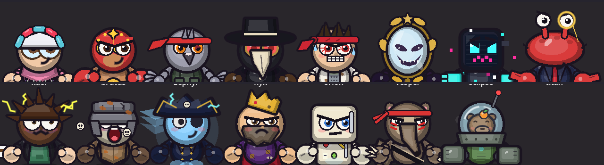
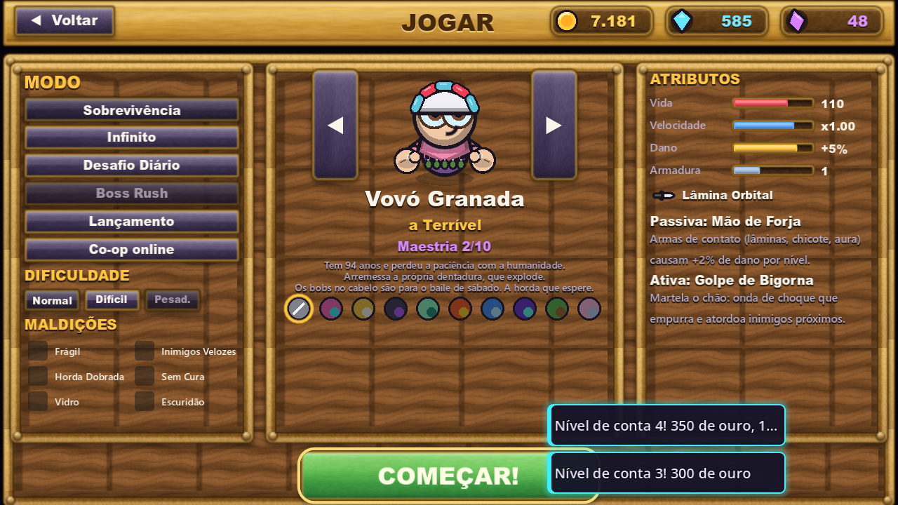

# HORDA INFINITA

**Roguelite de sobrevivência contra hordas.** Escolha um herói absurdo, sobreviva a ondas cada vez maiores, suba de nível, monte sua build com cartas e enfrente os chefes.

### [▶ Jogar agora no navegador](https://horda-infinita.netlify.app) · [⬇ Baixar para PC e Android](https://horda-infinita.netlify.app/baixar.html)

## Os heróis

15 heróis originais, cada um com arma, habilidade passiva, habilidade ativa, falas e skins próprias: **Vovó Granada**, **El Sofá**, **Pombo Vingador**, **Dr. Febre**, **Contador Furioso**, **Sr. Espelho**, **GL1TCH**, **Caranguejo de Terno**, **Laura, a Barista Elétrica**, **O Imortal Entediado**, **Capitã Tempestade**, **Rei Falido**, **Geladeira Ambulante**, **Tamanduá Berserker** e **Mecha-Capivara**.

## Galeria

| Menu principal | Escolha do herói |
| --- | --- |
|  |  |
| **Cartas de level-up** | **Loja** |
|  |  |

## O que tem no jogo

- **12 armas com 8 níveis e evolução**, de fuzil e lança-foguetes a drone, chicote de plasma e buraco negro.
- **5 biomas que mudam durante a partida**: Campo Esquecido, Deserto Escaldante, Pântano Sombrio, Terras Vulcânicas e Geleira Eterna.
- **Mapa para explorar**: caixotes, baús, santuários de bônus, tesouros, ovos que chocam pets e totens que invocam aliados.
- **Chefes com fases**, elites, eventos de horda, combos de abates e medidor de dificuldade.
- **Modos**: Sobrevivência (3 dificuldades), Infinito, Desafio Diário, Boss Rush, Maldições e Lançamento.
- **Progressão**: upgrades permanentes, liga por temporada, Ascensão, missões, passe e 70 conquistas.
- **Skins e acessórios premium**: boné, coroa, asas, aura de fogo, kabuto, viking, pirata, dragão e outros.

## Como jogar

| Ação | Teclado | Controle |
| --- | --- | --- |
| Andar | WASD ou setas | Analógico esquerdo |
| Habilidade | Espaço | A |
| Escolher carta | 1 a 4 ou clique | Direcional + A |
| Rerolar / Banir / Pular | R / B / X | — |
| Pausar | Esc | Start |

No celular, arraste o dedo na tela para andar.

## Suporte e comunidade

- **Encontrou um bug?** Abra uma [issue de bug](../../issues/new?template=bug.yml) dizendo o navegador ou aparelho e o que aconteceu.
- **Tem uma ideia?** Abra uma [sugestão](../../issues/new?template=sugestao.yml).
- **Quer conversar**, mostrar uma build ou um recorde? Use as [Discussões](../../discussions).
- **Novidades**: cada atualização vira um commit com a lista de mudanças no [CHANGELOG](CHANGELOG.md). Clique em **Watch** para ser avisado.

## Direitos autorais

© 2026 Eduardo Lorenzo. **Todos os direitos reservados.** Horda Infinita, seus personagens (nomes, aparência, personalidades, falas e histórias), arte, música e código são obra protegida pela Lei de Direitos Autorais (Lei nº 9.610/1998) e pela Lei de Software (Lei nº 9.609/1998). É proibido copiar, redistribuir, vender, extrair recursos ou criar obras derivadas sem autorização por escrito. Veja a [licença](LICENSE).

Pode compartilhar prints e vídeos do jogo nas redes, desde que cite **Horda Infinita** e o criador. Os sprites de monstros e baús vêm do pacote "0x72 Dungeon Tileset II", de domínio público (CC0).

Este repositório é só a página da comunidade: o código e os arquivos do jogo não são públicos.

## Criador

Feito por **Eduardo Lorenzo** · Instagram [@srlorenzos](https://www.instagram.com/srlorenzos/) · [GitHub](https://github.com/srlorenzos)
