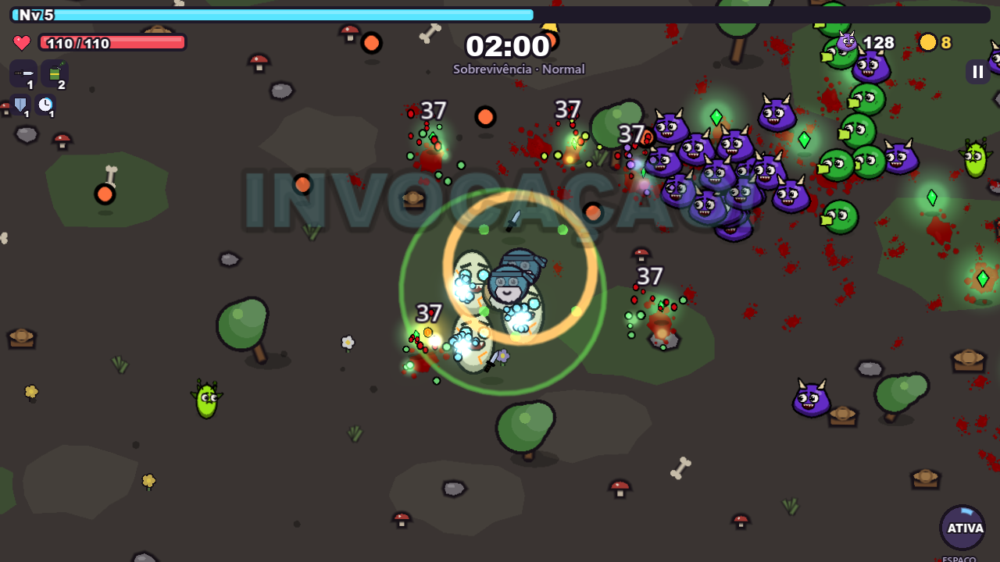
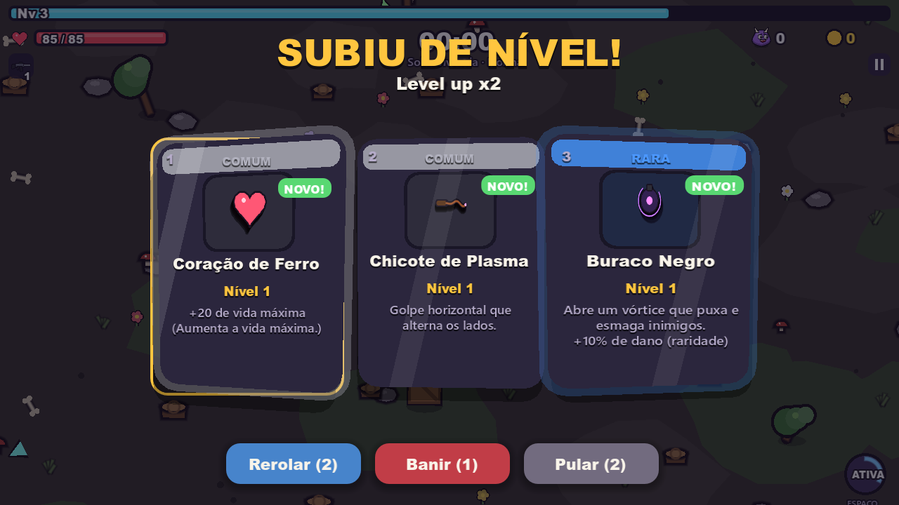
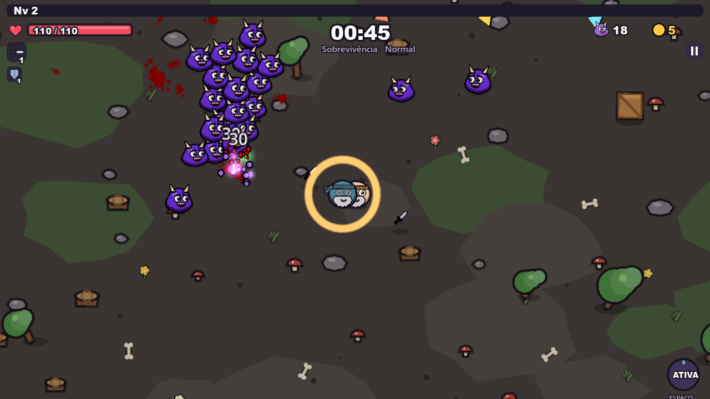
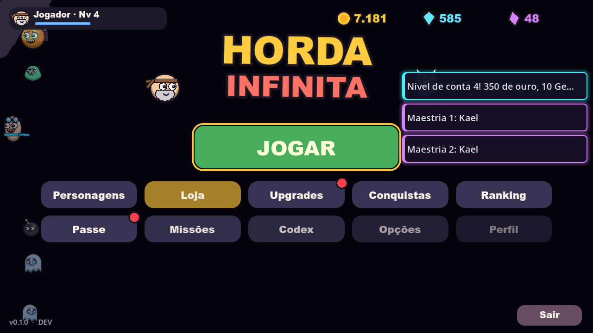
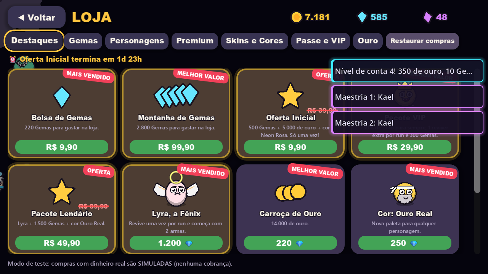

# Horda Infinita

Um roguelite de sobrevivência contra hordas. Você controla um herói de cara fechada, as armas atiram sozinhas e a única decisão que importa é para onde andar e qual carta escolher quando sobe de nível. Cada partida dura até 20 minutos, a arena muda de fase enquanto você sobrevive e o mapa esconde baús, santuários, ovos de pet e totens de invocação.

**Jogue no navegador:** https://horda-infinita.netlify.app

## Como jogar

| Ação | Teclado | Controle |
| --- | --- | --- |
| Andar | WASD ou setas | Analógico esquerdo |
| Dash / habilidade | Espaço | A |
| Escolher carta | 1 a 4 ou clique | Direcional + A |
| Rerolar / Banir / Pular | R / B / X | — |
| Pausar | Esc | Start |

No celular, arraste o dedo na tela para andar.

## O que tem no jogo

- **13 personagens** com habilidade própria e maestria.
- **12 armas com 8 níveis e evolução**: fuzil, taser, lança-foguetes, faca de combate, lança, bumerangue, drone e outras.
- **Fases que mudam durante a partida**: Campo Esquecido, Deserto Escaldante, Pântano Sombrio, Terras Vulcânicas e Geleira Eterna.
- **Mapa para explorar**: caixotes e vasos quebráveis, baús, santuários de bônus, marcas de tesouro, ovos que chocam pets e totens que invocam aliados.
- **Chefes com fases**, elites e eventos de horda.
- **Modos**: Sobrevivência (3 dificuldades), Infinito, Desafio Diário, Boss Rush, Maldições e Lançamento.
- **Progressão**: upgrades permanentes, nível de conta, missões, passe de temporada e 70 conquistas.
- **Acessórios premium**: boné, chapéu de xerife, coroa, asas e aura de fogo.

| | |
| --- | --- |
|  |  |
|  |  |

## Suporte e comunidade

- **Encontrou um bug?** Abra uma [issue de bug](../../issues/new?template=bug.yml). Diga o navegador ou aparelho e o que aconteceu antes do problema.
- **Tem uma ideia?** Abra uma [sugestão](../../issues/new?template=sugestao.yml).
- **Quer conversar sobre o jogo**, mostrar uma build ou um recorde? Use as [Discussões](../../discussions).

## Novidades

Cada atualização do jogo vira um commit neste repositório, com a lista de mudanças no [CHANGELOG](CHANGELOG.md). Clique em **Watch** no topo da página para ser avisado.

## Criador

Feito por Lorenzo · Instagram [@srlorenzos](https://www.instagram.com/srlorenzos/)

Este repositório é só a página da comunidade: o código e os arquivos do jogo não são públicos.
